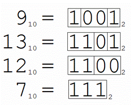

# Гений трейдинга

## Задача:
Сэм — известный криптовалютный трейдер, который разработал особый метод предсказания движения стейблкоинов. Каждый день он переводит номер дня в двоичную систему счисления и группирует одинаковые идущие подряд цифры. Если общее количество таких групп равно 3, то, по его алгоритму, акции пойдут вверх; в противном случае — вниз. Ваша задача — помочь Сэму определить количество дней, в которые акции пойдут вверх, в промежутке от дня \( X \) до дня \( Y \).

<center></center>

## Входные данные:
В единственной строке заданы два числа, разделенные пробелом, \( X \) и \( Y \) (1 ≤ \( X \) ≤ \( Y \) ≤ 10^18).

## Выходные данные:
Выведите количество дней, когда акции пойдут вверх.

## Примеры:

### Ввод:
```
259 263
```
### Вывод:
```
2
```