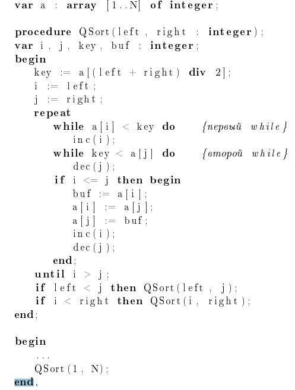

# Анти-QuickSort

## Задача:
Необходимо написать программу, генерирующую тест, на котором быстрая сортировка (QuickSort) выполнит максимальное количество сравнений. QuickSort обычно является очень эффективным алгоритмом сортировки, но существуют наборы данных, на которых его производительность снижается.

## Входные данные:
Единственное число \( n \) (1 ≤ \( n \) ≤ 70000) — размер последовательности.

## Выходные данные:
Выведите перестановку чисел от 1 до \( n \), на которой быстрая сортировка выполнит максимальное количество сравнений. Если существует несколько таких перестановок, вывести любую из них.

## Примеры:

### Ввод:
```
3
```
### Вывод:
```
1 3 2
```

## Примечание:
Предполагается, что используется следующий псевдокод быстрой сортировки:

<center></center>
